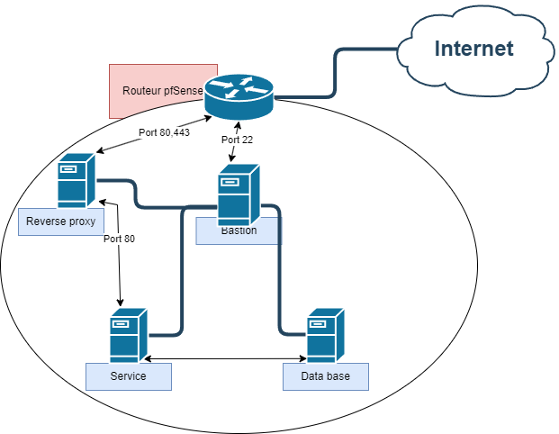

# B2-project

## Service

- Nextcloud

# 1. Prérequis

## A. Les machines

- Ce projet a été réalisé avec 5 machines, à savoir, un bastion, un reverse proxy, une machine où le service tourne, une base de données et un routeur.

Toutes les machines sauf le routeur sont sur une distribution Rocky Linux 9.

Le routeur quant à lui est sous une distribution spéciale de BSD, une image spécifique pfSense.

Chaque machine doit avoir un user avec les droits sudo en no-passwd pour faciliter l'utilisation d'ansible.

## B. Technologies utilisées

- pfSense firewall / Router - opensense (configurable CLI)
- Caddy Reverse proxy / Loadbalancer / Https
- Bastion SSH

## C. Moyen de déploiement automatisé

- Ansible

Pour utiliser ansible, il faut déjà avoir installé python sur les machines.

Il faut aussi setup au préalable un échange de clé ssh pour ne pas avoir à rentrer le mot de passe.

Pour plus de détails:

[Doc d'installation ansible](https://docs.ansible.com/ansible/latest/installation_guide/index.html)

# 2. Schéma de l'architecture

# 3. Comment déployer notre solution

## A. Déploiement des machines

Premièrement, il vous faudra une infrastructure réseau similaire à la notre pour que le playbook fonctionne.

## B. Préparer la machine pfSense

Sur la machine PfSense, suivre l'installation.

On aura aussi besoin d'ajouter le packet sudo dans le menu:
System > Package Manager > Install Sudo

Enfin, il faudra ajouter un utilisateur avec les permissions Shell account access et SSH tunneling puis ajouter le user dans les sudoers en NoPassword

# 4 - Déploiement de la solution

Une fois assuré que toutes les machines sont mises en place, on peut lancer le playbook pour automatiser la configuration.

Pour le controller node
Avoir python, ansible, et les collections en dessous
`ansible-galaxy collection install pfsensible.core community.mysql`

Pour lancer le playbook, il faut se placer dans le dossier ansible et lancer la commande suivante :

`ansible-playbook -i hosts.yml playbook.yml`

La solution est maintenant joignable depuis l'adresse ip publique du routeur.
